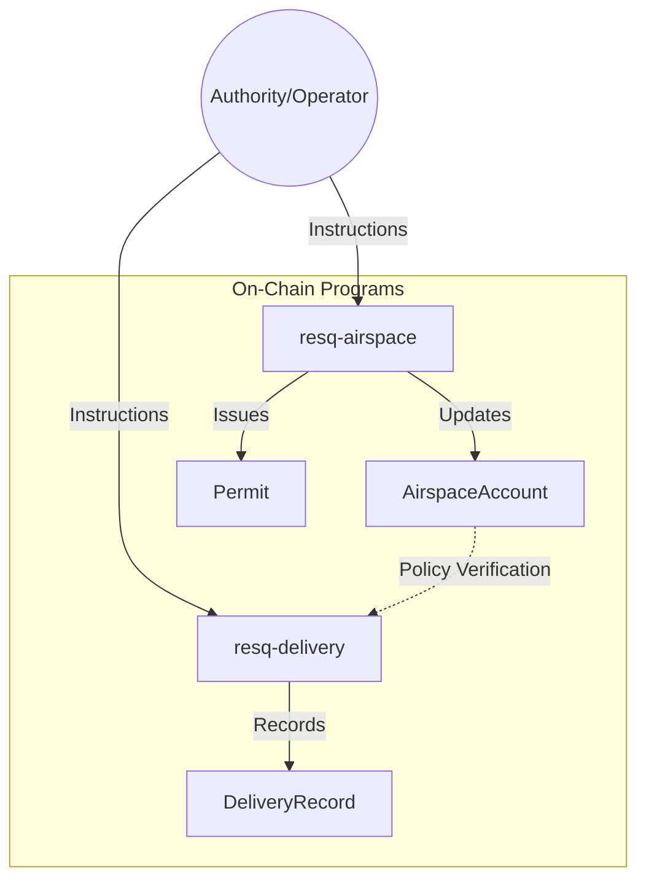

# ResQ Programs

[](https://github.com/resq-software/programs/actions/workflows/ci.yml)
[](./LICENSE)

ResQ Programs is the decentralized coordination layer for autonomous aerospace and delivery operations. Built using [Anchor 0.30](https://www.anchor-lang.com/), these Solana on-chain programs enforce geofencing, permit issuance, and mission lifecycle management.

---

## Table of Contents

1. [Overview](#overview)
2. [Features](#features)
3. [Architecture](#architecture)
4. [Quick Start](#quick-start)
5. [Usage](#usage)
6. [Configuration](#configuration)
7. [API Overview](#api-overview)
8. [Development](#development)
9. [Contributing](#contributing)
10. [Roadmap](#roadmap)
11. [License](#license)

---

## Overview

ResQ Programs provide the trust-minimized substrate for physical automation. By offloading rule enforcement to the Solana blockchain, the ResQ ecosystem ensures that air traffic protocols and delivery missions are immutable, transparent, and verifiable by all stakeholders.

### Key Components
* **`resq-airspace`**: Governs access control to physical airspace. Handles zone registration, policy updates, and flight permit granting.
* **`resq-delivery`**: Manages the mission-critical state of autonomous delivery vehicles, including status tracking and delivery confirmation.

---

## Features

* **Proof-of-Permit**: Cryptographically enforce that only authorized drones operate in restricted airspace.
* **Autonomous Lifecycle**: Atomic state transitions for delivery missions (Created -> In-Transit -> Completed).
* **Policy-as-Code**: Airspace policies (altitude, time-of-day, proximity) are enforced by on-chain logic.
* **Auditable History**: Every crossing and delivery is recorded on-chain for regulatory compliance.

---

## Architecture

The following diagram illustrates the relationship between the programs and the Solana state accounts.



---

## Quick Start

### Prerequisites
* **Rust**: `stable`
* **Solana CLI**: `2.1.0`
* **Anchor CLI**: `0.30.1`

### Execution
```bash
# Clone and setup environment
git clone https://github.com/resq-software/programs.git
cd programs
./scripts/setup.sh

# Compile programs
anchor build

# Execute integration tests
anchor test
```

---

## Usage

### 1. Registering Airspace
Defining a new zone requires an authority account to initialize the account state.

```typescript
const tx = await program.methods
  .initializeProperty({ lat: 45.5, lon: -122.6, radius: 100 })
  .accounts({ authority: wallet.publicKey })
  .rpc();
```

### 2. Recording a Delivery
Updates the delivery state upon a successful drop-off event.

```typescript
await delivery.methods
  .recordDelivery(deliveryId, { status: "COMPLETED" })
  .accounts({ operator: pilot.publicKey })
  .rpc();
```

---

## Configuration

The project behavior is defined in `Anchor.toml`. Key configurations include:

* **Cluster**: Set to `Localnet` for development and `Devnet` for testing against public nodes.
* **Environment Variables**:
    * `SOLANA_VERSION`: Overrides the default `2.1.0`.
    * `ANCHOR_VERSION`: Overrides the default `0.30.1`.

---

## API Overview

### `resq-airspace`
* `initialize_property`: Sets up a new geo-fenced region.
* `grant_permit`: Allows a specific public key to access a region.
* `update_policy`: Adjusts rules for an existing region.
* `record_crossing`: Log entry for a vehicle entering/exiting an airspace.

### `resq-delivery`
* `record_delivery`: Finalizes a delivery mission state.
* `update_status`: Adjusts mission state (In Transit, Failed, Completed).

---

## Development

### Testing
Tests are located in `resq-airspace/tests` and `resq-delivery/tests`. They use `solana-test-validator` to mock the environment. Run with:
```bash
anchor test
```

### Git Hooks
The repository includes pre-configured hooks in `.git-hooks/`. To enable them, ensure they are symlinked or copied to your local `.git/hooks` directory. These enforce:
- Commit message linting
- CI-passing checks before push
- Formatting compliance

---

## Contributing

We strictly follow [Conventional Commits](https://www.conventionalcommits.org/).

1. **Fork** the repository.
2. **Feature branch**: `feat/your-feature` or `fix/your-fix`.
3. **Audit**: Run the provided audit tools (see `.github/skills/`).
4. **Pull Request**: Ensure CI passes all checks.

Refer to `CONTRIBUTING.md` for complete guidelines on security audits and protocol additions.

---

## Roadmap

- [ ] **Q3 2026**: Transition to Anchor 0.31+ compatibility.
- [ ] **Q4 2026**: Implement cross-program invocation (CPI) for automated airspace entry/exit tolls.
- [ ] **Q1 2027**: Zero-Knowledge Proof (ZKP) integration for anonymous permit verification.

---

## License

Copyright 2026 ResQ. Distributed under the Apache License, Version 2.0. See [LICENSE](./LICENSE) for details.