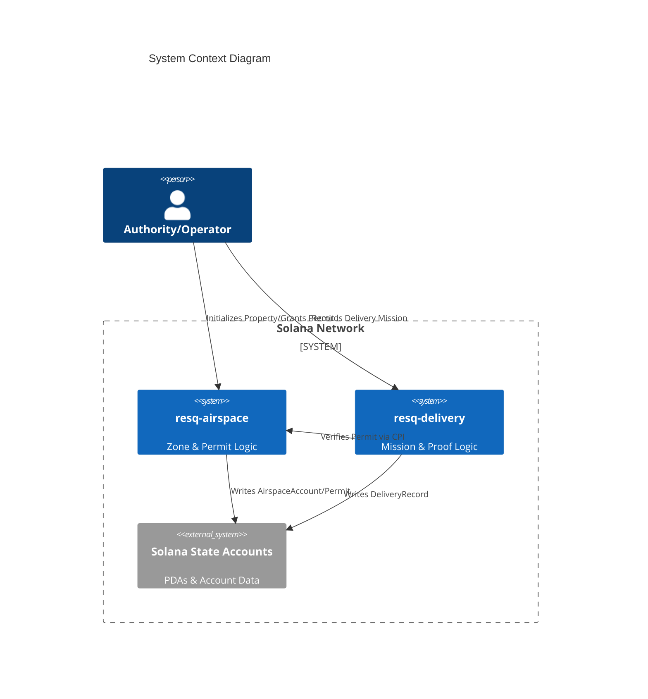

# ResQ Programs

[](https://github.com/resq-software/programs/actions/workflows/ci.yml)
[](./LICENSE)

ResQ Programs is the decentralized coordination layer for autonomous aerospace and delivery operations built on Solana.

## Overview

ResQ Programs provide the trust-minimized substrate for physical automation. By offloading rule enforcement to the Solana blockchain, the ResQ ecosystem ensures that air traffic protocols and delivery missions are immutable, transparent, and verifiable.

### Key Components

*   **`resq-airspace`**: Governs physical airspace access. It manages zone registration, access policies (Open, Permit, Deny, Auction), and cryptographic permit issuance.
*   **`resq-delivery`**: Manages the mission-critical state of autonomous delivery vehicles, including immutable proof-of-delivery logging and coordinate validation.

## Features

*   **Proof-of-Permit**: Cryptographically enforce that only authorized drones operate in restricted airspace.
*   **Autonomous Lifecycle**: Atomic state transitions for delivery missions.
*   **Policy-as-Code**: Airspace policies (altitude, geofencing, proximity) are enforced by on-chain logic.
*   **Auditable History**: Every crossing and delivery is recorded on-chain for regulatory compliance.

## Architecture

The system utilizes Program-Derived Addresses (PDAs) for state management. Permissions are granted via PDA-based `Permit` accounts, which are checked by the `resq-airspace` program before processing crossing events.



## Installation

### Prerequisites

*   **Rust**: `stable` (via `rustup`)
*   **Solana CLI**: `2.1.0` (ensure you have this specific version by running `solana-install-toolchain --version 2.1.0` if needed)
*   **Anchor CLI**: `0.30.1` (managed via `avm`)

### Environment Setup

This project uses Nix to manage its development environment, ensuring consistent tooling across all developers.

1.  **Install Nix**: If you don't have Nix installed, follow the instructions at [nixos.org/download.html](https://nixos.org/download.html). This script will attempt to install Nix if it's not found.
2.  **Enter the Dev Shell**: Navigate to the project root and run:
    ```bash
    nix develop
    ```
    This command will download and set up all necessary dependencies, including Rust, Node.js, Bun, Solana CLI, and the specified Anchor version.

### Building the Programs

Once your environment is set up (either manually or via `nix develop`), build the programs:

```bash
# Clone the repository
git clone https://github.com/resq-software/programs.git
cd programs

# Bootstrap environment (installs dependencies/hooks)
./bootstrap.sh

# Build programs
anchor build
```

## Quick Start

Execute integration tests to verify the deployment state and core functionality:

```bash
# Run all tests against a local solana-test-validator
anchor test
```

## Usage

### Registering Airspace

To initialize a restricted zone, an owner must provide a unique 32-byte identifier and define altitude bounds.

```typescript
import * as anchor from "@coral-xyz/anchor";
import { Program } from "@coral-xyz/anchor";
import { ResqAirspace } from "../target/types/resq_airspace"; // Assuming types are generated

const program = anchor.workspace.ResqAirspace as Program<ResqAirspace>;
const wallet = anchor.Wallet.local(); // Get local wallet from Anchor configuration

const propertyIdBytes = [...Buffer.from("zone-nyc-01").padEnd(32, '\0')];
const minAltitude = 10; // meters AGL
const maxAltitude = 150; // meters AGL
const polygonVertices = [[0, 0]; 8]; // Example polygon, typically derived from geojson
const vertexCount = 1; // Number of valid vertices
const accessPolicy = { permit: {} }; // Or { open: {} }, { deny: {} }, { auction: {} }
const crossingFee = 1000; // Lamports
const treasury = new anchor.web3.Keypair().publicKey; // Address to receive fees

const tx = await program.methods
  .initializeProperty(
      propertyIdBytes,
      new anchor.BN(minAltitude),
      new anchor.BN(maxAltitude),
      polygonVertices,
      vertexCount,
      accessPolicy,
      new anchor.BN(crossingFee),
      treasury
  )
  .accounts({ owner: wallet.publicKey })
  .rpc();

console.log("Airspace property initialized:", tx);
```

### Granting a Permit

An owner can grant a permit to a specific drone PDA for a defined period.

```typescript
import * as anchor from "@coral-xyz/anchor";
import { Program } from "@coral-xyz/anchor";
import { ResqAirspace } from "../target/types/resq_airspace";

const program = anchor.workspace.ResqAirspace as Program<ResqAirspace>;
const ownerWallet = anchor.Wallet.local();

const airspacePda = new anchor.web3.PublicKey("..."); // Address of the AirspaceAccount
const dronePda = new anchor.web3.PublicKey("..."); // PDA of the drone
const expiresAt = Math.floor(Date.now() / 1000) + 3600; // Permit expires in 1 hour (Unix timestamp)

const tx = await program.methods
  .grantPermit(dronePda, new anchor.BN(expiresAt))
  .accounts({
      owner: ownerWallet.publicKey,
      airspace: airspacePda,
      // The permit PDA will be derived by Anchor
  })
  .rpc();

console.log("Permit granted:", tx);
```

### Recording a Delivery

Finalize a mission by logging the proof-of-delivery CID and GPS coordinates.

```typescript
import * as anchor from "@coral-xyz/anchor";
import { Program } from "@coral-xyz/anchor";
import { ResqDelivery } from "../target/types/resq_delivery"; // Assuming types are generated

const program = anchor.workspace.ResqDelivery as Program<ResqDelivery>;
const droneWallet = anchor.Wallet.local(); // Assuming this is the drone's authority keypair

const deliveryTargetAirspacePda = new anchor.web3.PublicKey("..."); // Target airspace account
const ipfsCid = "QmResQTestCID1234567890abcdefghijklmnopqrstuvwxyz"; // IPFS CID of proof
const latitude = 407128000; // 40.7128000 * 1e7
const longitude = -740060000; // -74.0060000 * 1e7
const altitude = 50; // meters
const deliveredTimestamp = Math.floor(Date.now() / 1000); // Unix timestamp

// Convert CID to byte array (must be 64 bytes, null-padded)
const cidBytes = new Uint8Array(64);
Buffer.from(ipfsCid).copy(cidBytes);

const tx = await program.methods
  .recordDelivery(
      cidBytes,
      new anchor.BN(latitude),
      new anchor.BN(longitude),
      new anchor.BN(altitude),
      new anchor.BN(deliveredTimestamp)
  )
  .accounts({
      drone: droneWallet.publicKey,
      airspace: deliveryTargetAirspacePda,
      // The delivery_record PDA will be derived by Anchor
  })
  .rpc();

console.log("Delivery recorded:", tx);
```

## Configuration

Configuration for local development and deployments is managed in `Anchor.toml`.

*   **`[programs.localnet]` / `[programs.devnet]`**: Defines custom Program IDs for each cluster. Ensure these match the `declare_id!("...")` macro in your Rust code.
*   **`[provider]`**: Configures the default cluster URL and wallet keypair for Anchor commands.
*   **Environment Overrides**:
    *   `SOLANA_VERSION`: Ensure the `solana-cli` version matches dependencies.
    *   `ANCHOR_VERSION`: Managed by `avm` (via Nix).

## API Reference

### `resq-airspace` Program

*   **`initialize_property`**: Creates a new `AirspaceAccount` for a specific property, defining its geographic bounds, altitude restrictions, and access policy.
    *   **Arguments**: `property_id`, `min_alt_m`, `max_alt_m`, `poly`, `vertex_count`, `policy`, `fee_lamports`, `treasury`.
    *   **Accounts**: `owner` (mut), `airspace` (init), `system_program`.
*   **`update_policy`**: Modifies the `AccessPolicy` and `fee_lamports` of an existing `AirspaceAccount`.
    *   **Arguments**: `policy`, `fee_lamports`.
    *   **Accounts**: `owner` (mut), `airspace` (mut).
*   **`grant_permit`**: Issues a `Permit` PDA for a specific drone, granting it access under certain airspace policies.
    *   **Arguments**: `drone_pda`, `expires_at`.
    *   **Accounts**: `owner` (mut), `airspace`, `permit` (init), `system_program`.
*   **`record_crossing`**: Logs a drone's passage through an airspace. If the policy requires a permit, it verifies the `Permit` PDA. Collects crossing fees if configured.
    *   **Arguments**: `lat`, `lon`, `alt_m`, `crossed_at`.
    *   **Accounts**: `drone` (mut), `airspace`, `permit` (optional, required for `Permit` policy), `treasury` (mut), `system_program`.

### `resq-delivery` Program

*   **`record_delivery`**: Creates an immutable `DeliveryRecord` PDA. This serves as proof-of-delivery, storing an IPFS CID of evidence and delivery coordinates.
    *   **Arguments**: `ipfs_cid`, `lat`, `lon`, `alt_m`, `delivered_at`.
    *   **Accounts**: `drone` (mut), `airspace` (account info), `delivery_record` (init), `system_program`.

## Configuration

Configuration is primarily handled via `Anchor.toml` and environment variables.

*   **`Anchor.toml`**: Specifies program IDs for different clusters (`localnet`, `devnet`), default provider settings (cluster URL, wallet), and script commands.
*   **Environment Variables**:
    *   `SOLANA_CLI_VERSION`: Not directly used, but `bootstrap.sh` and `flake.nix` pin specific versions.
    *   `ANCHOR_VERSION`: Managed by `avm` for cross-version compatibility.

## Development

### Error Handling

Errors are defined using Anchor's `#[error_code]` enum within each program's `error.rs` file.

*   **Constraint Violations**: Anchor macros (`has_one`, `constraint`, `seeds`) automatically return standard Anchor errors (e.g., `AccountNotFound`, `ConstraintViolation`) if validation fails.
*   **Custom Logic**: Use the `require!` and `require_keys_eq!` macros to enforce business logic rules and return descriptive, actionable errors to the client.

### Cross-Program Interaction (CPI)

Interactions between `resq-airspace` and `resq-delivery` are primarily through Cross-Program Invocations (CPI) or by simply referencing account addresses.

*   The `resq-delivery` program reads the `airspace_pda` to associate a delivery with a property, but it does not directly invoke `resq-airspace` instructions. Instead, off-chain logic or a separate "aggregator" program would typically coordinate these calls.
*   The `resq-airspace` program's `record_crossing` instruction checks the `drone` PDA and its associated `Permit` account. This ensures that while `resq-delivery` logs the mission, `resq-airspace` enforces access rules independently.

### .claude AI-Assisted Development Workflow

This repository integrates with the `.claude` AI tooling for enhanced development. The `.claude/` directory mirrors the structure of `.github/` and contains AI agents, commands, rules, and skills.

*   **Agents (`.claude/agents/`)**: Define AI personas tailored to specific development roles (e.g., `anchor-engineer`, `solana-architect`). These agents provide context-aware assistance based on the project's codebase and Solana/Anchor best practices.
*   **Commands (`.claude/commands/`)**: Define AI-driven commands for common development tasks, such as `audit`, `build`, `deploy`, and `test`. These commands can trigger specific AI analyses or actions.
*   **Rules (`.claude/rules/`)**: Contain security and testing guidelines that the AI should adhere to. The `security.md` and `testing.md` files outline critical principles for on-chain development.
*   **Skills (`.claude/skills/`)**: Provide specialized AI capabilities, such as `feynman-auditor` for deep logic analysis and `state-inconsistency-auditor` for identifying state synchronization issues.

When the AI is invoked (e.g., through an integrated chat interface or specific command execution), it leverages these configurations to provide relevant insights, code suggestions, or perform analyses aligned with the project's specific needs and architectural patterns.

### Security Assumptions and Threat Model

*   **Core Assumption**: Solana's network security and consensus mechanisms are robust. Program logic is the primary attack surface.
*   **Key Threats**:
    *   **Logic Flaws**: Bugs in instruction handlers leading to incorrect state transitions, unauthorized access, or financial exploits. This is addressed by rigorous testing, secure coding practices, and AI-assisted auditing.
    *   **Account Exploitation**: Issues with PDA derivation, incorrect account constraints, or missing PDA bump seed validation. Addressed by strict Anchor usage and explicit seed checks.
    *   **Cross-Program Interaction Misuse**: Improper validation of CPIs, trusting external program states implicitly, or race conditions between programs. Addressed by unidirectional validation where possible and explicit cross-program checks (e.g., `resq-airspace` verifying `Permit` accounts).
    *   **Economic Exploits**: Manipulation of fees, race conditions around permit issuance/expiry, or exploitation of policy parameters. Addressed by well-defined fee structures and clear expiry logic.
    *   **Client-Side Vulnerabilities**: Malicious actors manipulating transaction construction or submitting outdated state. Mitigated by immutability on-chain and robust off-chain client validation.
*   **Mitigation Strategies**:
    *   **Formal Verification (Future)**: Exploring tools for formal verification of critical smart contract logic.
    *   **Economic Audits**: Specific focus on incentive alignment and potential economic attack vectors.
    *   **Access Control**: Strict adherence to owner-only mutations, PDA authority checks, and role-based permissions.

## Development

### Local Validator Setup

`anchor test` automatically starts a `solana-test-validator` instance. Ensure you have sufficient disk space for validator data, as it can grow over time. If the validator fails to start, try removing the `.anchor/` directory and rerunning.

### Testing

All tests are located in the `tests/` directory and are written using the `@coral-xyz/anchor` TypeScript framework. Comprehensive tests include:

*   Happy-path scenarios for all instructions.
*   Error condition tests for each `#[error_code]`.
*   Edge case testing for values, bounds, and state transitions.
*   Concurrency and race condition simulation where applicable (though Solana's transaction model simplifies this compared to traditional multi-threaded systems).

## Contributing

We follow the [Conventional Commits](https://www.conventionalcommits.org/) specification for commit messages.

1.  **Feature Branch**: Create branches using prefixes like `feat/` or `fix/` (e.g., `feat/add-new-policy-type`).
2.  **Code Quality**: Ensure all code passes `cargo fmt --all` and `cargo clippy -- --D warnings`.
3.  **Security**: Run `cargo audit` and adhere to the security rules outlined in `.github/rules/security.md`.
4.  **Testing**: All new functionality must be accompanied by comprehensive unit and integration tests.
5.  **Pull Request**: Submit a Pull Request detailing the changes, referencing any relevant issues. PRs must pass all CI checks.

## License

Copyright 2026 ResQ. Distributed under the Apache License, Version 2.0. See [LICENSE](./LICENSE) for full details.